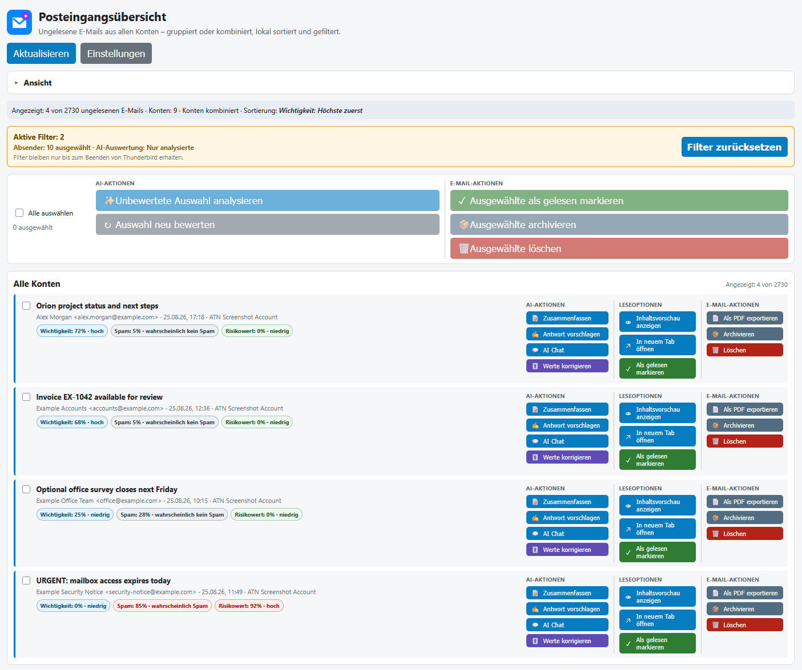
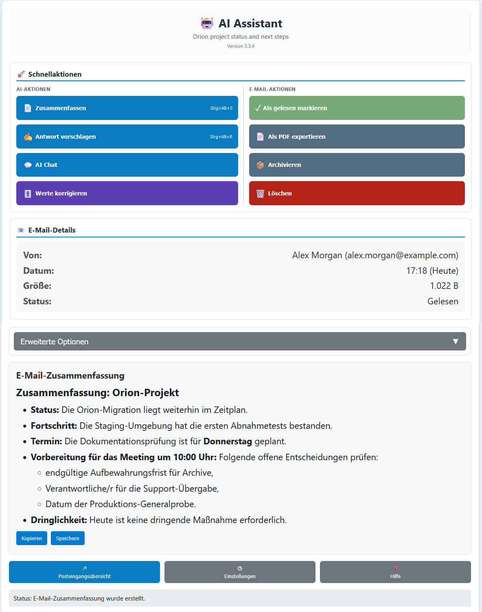
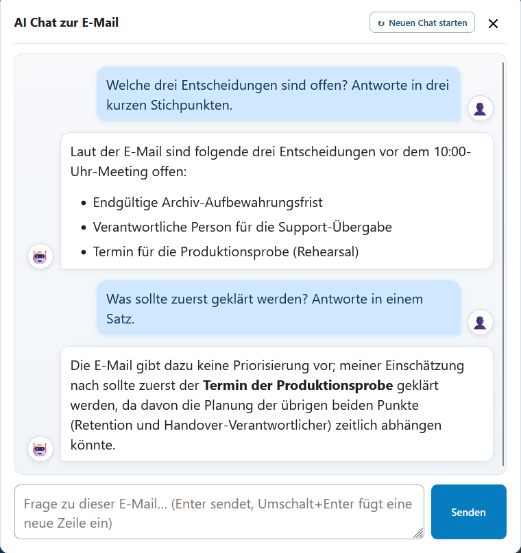
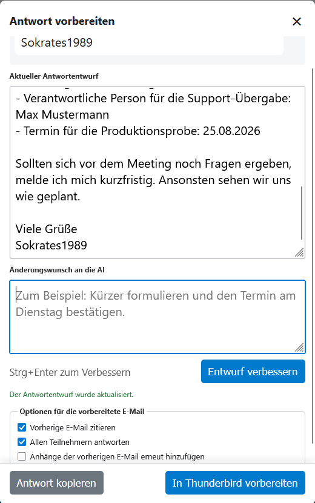
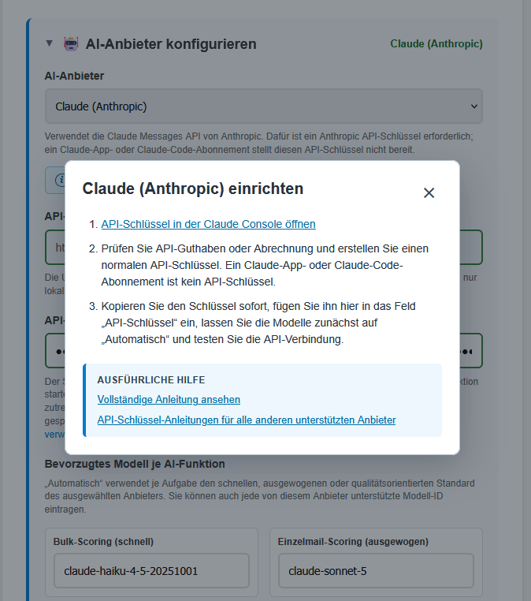

# AI Mail Assistant for Thunderbird

> **[The complete README is also available in German.](README.de.md)**

A Thunderbird 128+ MailExtension for summaries, reply drafting, configurable
email analysis, and inbox triage with a selectable AI provider.

## Downloads and releases

- **[Install from Thunderbird Add-ons](https://addons.thunderbird.net/thunderbird/addon/ai-mail-assistant/)** (recommended for automatic add-on updates)
- [Latest release](https://github.com/Sokrates1989/thunderbird-ai/releases/latest)
- [Release and version history](https://github.com/Sokrates1989/thunderbird-ai/releases)
- [Latest XPI](https://github.com/Sokrates1989/thunderbird-ai/releases/latest/download/thunderbird-ai.xpi)
- [SHA-256 checksums](https://github.com/Sokrates1989/thunderbird-ai/releases/latest/download/SHA256SUMS.txt)

The stable XPI and checksum names always select the latest GitHub release. Each
release also retains a versioned XPI, reviewer source archive, and checksums for
a traceable history.

**New to API setup?** The [API-key guide index](docs/api-keys/README.md) links
individual instructions for OpenAI, Claude (Anthropic), Mistral, DeepSeek, and
custom endpoints. The [AI provider test matrix](docs/ai-provider-testing.md)
separates automated protocol coverage from real-provider acceptance.

## Screenshots

Each preview links to the original-resolution image.

<table>
  <tr>
    <td width="50%">
      <a href="docs/images/ai-mail-assistant-dashboard-de.png"></a><br>
      <sub>Inbox dashboard with filters, importance sorting, AI scores, and grouped actions.</sub>
    </td>
    <td width="50%">
      <a href="docs/images/ai-mail-assistant-summary-de.png"></a><br>
      <sub>Single-message assistant with a readable Markdown-formatted summary.</sub>
    </td>
  </tr>
  <tr>
    <td width="50%">
      <a href="docs/images/ai-mail-assistant-chat-de.png"></a><br>
      <sub>Email-scoped AI Chat with persistent conversation history.</sub>
    </td>
    <td width="50%">
      <a href="docs/images/ai-mail-assistant-reply-refinement-de.png"></a><br>
      <sub>AI-generated reply draft with an editable refinement request.</sub>
    </td>
  </tr>
  <tr>
    <td width="50%">
      <a href="docs/images/ai-mail-assistant-reply-result-de.png"></a><br>
      <sub>Updated reply draft ready to open in Thunderbird.</sub>
    </td>
    <td width="50%">
      <a href="docs/images/ai-mail-assistant-provider-help-de.png"></a><br>
      <sub>Built-in provider setup help with links to the complete documentation.</sub>
    </td>
  </tr>
</table>

## Release 3.6.0 scope

Release 3.6.0 adds an opt-in **Include read messages** control to the dashboard's
**Date range and senders** group. Unread-only remains the default. Enabling the
control re-queries each Inbox for read and unread headers, retains the choice for
the current Thunderbird session, and reports the broader source in the active
filter summary. Read rows use normal-weight subjects and offer **Mark as unread**.

## Release 3.5.7 scope

Release 3.5.7 restores the full-height selection surface for each dashboard
message. Clicking unused space in the message tile selects or deselects the
message again, while the action buttons and optional message-preview controls
remain independent. This patch is distributed through Thunderbird Add-ons; it
does not introduce a new native installer build.

## Release 3.5.6 scope

Release 3.5.6 makes the single-message read-state action reversible. An unread
message shows the green **Mark as read** action; a read message instead shows an
amber **Mark as unread** action. After either operation, Thunderbird's actual
message state, the detail status, action label, icon, accessible description,
and color update together without reopening the workspace.

The collapsed dashboard view also remains understandable at a glance.
The message-result row now states whether accounts are separated or combined and
emphasizes the active sort order. The contextual filter card lists only active
sender, date, AI-status, and score-threshold values alongside its one-click reset.
Those narrowing filters remain limited to the current Thunderbird session. The
global and account result counters now consistently compare the visible rows with
the complete unread source snapshot, such as `Shown: 4 of 15`.

## Features

- Summaries based on the decoded MIME message body, with safe Markdown formatting.
- Interactive reply editor with AI refinement, direct editing, native
  Thunderbird reply handoff, Reply All, quoting, and attachment options.
- Importance, spam, and risk scoring with editable percentages and separate
  correction reasons.
- Translation to German, English, French, or Spanish.
- Extraction of contacts, dates, amounts, references, and tasks.
- Message-related AI Chat and local search for similar messages.
- Selectable OpenAI, Claude (Anthropic), Mistral, DeepSeek, or compatible custom
  HTTPS/localhost endpoint.
- Per-task model routing with automatic fast, balanced, and quality roles.
- Local result storage, support diagnostics, usage counters, and an OpenAI-only
  token-based cost estimate with a disclosed price snapshot.
- Global Inbox dashboard with complete header pagination, unread-only defaults,
  an optional session-bound read-message scope, account or
  combined latest-50 views, session-only sender/date/score filters, a prominent
  active-filter counter and reset action, durable sorting/layout preferences,
  bulk actions, and configurable local content previews.
- Single-message and bulk scoring through the same guarded workflow, including
  explicit re-analysis and a correction archive independent of message deletion.
- Local bounded spam precheck using sender frequency and structural newsletter
  or bulk-mail signals without transmitting other messages.
- Three clearly separated action groups: AI actions, reading options, and email
  actions. Available operations include preview, open in tab, mark read, PDF
  export, archive, and delete.
- Expandable previews in four-line increments up to 20 lines, reset, close, and
  open-original controls.
- Equivalent right-click context actions with direct titled groups or optional
  grouped submenus.
- Independent overlay/tab preferences for the global dashboard and
  single-message assistant.
- Wake-safe toolbar routing, stale-dashboard replacement after updates, bounded
  retries, and content-free support diagnostics.
- Complete English and German UI and documentation.
- Reviewed Thunderbird Add-ons distribution plus a standalone XPI release.

## AI providers and models

OpenAI remains the default and uses the Responses API with `store: false`.
Claude uses Anthropic Messages. Mistral and DeepSeek use compatible Chat
Completions APIs. Claude requires an Anthropic API key; a Claude app or Claude
Code subscription cannot be reused as add-on API authentication.

DeepSeek V4 enables thinking by default. The add-on sends `thinking: disabled`
because its email functions consume only final text and use bounded output.

Custom endpoints may use OpenAI Chat, OpenAI Responses, or Anthropic Messages
with Bearer, `x-api-key`, or no authentication. Remote endpoints must use HTTPS;
HTTP is allowed only for `localhost` and `127.0.0.1`. The service must actually
implement the selected JSON protocol.

**Automatic** model selection maps each task to the provider's fast, balanced,
or quality preset. For OpenAI these roles are:

- `gpt-5.6-luna` for cost-sensitive bulk analysis;
- `gpt-5.6-terra` for single-message scoring; and
- `gpt-5.6-sol` for summaries, replies, and AI Chat.

Every task model can also be set to any model ID supported by the selected
provider. Bulk requests contain at most eight messages with no more than two
requests in parallel.

The **spam score** estimates unwanted bulk, advertising, or stray mail. The
independent **risk score** estimates phishing, social engineering, fraud,
suspicious links or attachments, threats, potentially unlawful offers, and
unwanted contact. It is an AI estimate, not a malware scan or legal opinion.

Before scoring, the add-on counts messages with the same full sender address
locally, up to 1,000 matches, and caches the aggregate for ten minutes. It also
recognizes List-Unsubscribe/List-ID, bulk headers, automated senders,
unsubscribe wording, and campaign-link signals. Frequency alone is never proof
of spam, and saved sender corrections take precedence over the local floor.

Temporary network failures, timeouts, rate limits, and provider errors are
retried at most twice with bounded delays. `Retry-After` is honored up to ten
seconds. Invalid keys, exhausted credit, and permanent client errors fail
without pointless retries.

## Thunderbird archiving

**Archive** and **Archive selected** call Thunderbird's native archive action,
so account and identity settings determine the destination. To obtain
`Archive/<sent year>`, choose **Yearly archived folders** for the identity under
**Account Settings → Copies & Folders → Message Archives → Archive options**.
Services such as Gmail can impose a different server-side archive model.

Under **Settings → Thunderbird archiving**, **Check archive folders** shows only
folders Thunderbird marks as archives, direct year folders, and reported
subfolder capability. The check changes no mail or settings. MailExtensions
cannot deep-link to protected account settings or read the yearly-folder choice,
so the add-on provides the exact manual path and official Thunderbird help.

## Privacy

An AI action sends subject, sender, message text, and recognized attachment
names directly from Thunderbird to the selected provider or custom endpoint.
Reply refinement additionally sends the current draft and recent refinement
instructions. Normal bulk analysis sends only explicitly selected messages
without an existing dashboard score; re-analysis requires an explicit confirmed
action.

Uncorrected scores store a stable local message identity, percentages,
provider, model, and timestamp. Corrected scores also store separate importance,
spam, and risk reasons. At most 1,000 score records are retained. The local spam
precheck sends only aggregates—not other message bodies, raw headers, or URLs.

One action can send the same AI input up to three times after retryable failures,
which can incur additional provider cost. Token usage is counted by provider
and model. Only known OpenAI models receive a local USD estimate; other provider
calls are counted but not priced.

Explicit corrections are also stored in a separate archive of at most 250
records. Each can contain a message excerpt of up to 6,000 characters,
attachment names, original/corrected values, and reasons. Up to five relevant
examples may be sent as untrusted calibration examples during later scoring.
This is contextual example learning, not model fine-tuning. The archive is not
removed when Thunderbird messages are deleted and can be managed in Settings.

API keys and saved results live in the Thunderbird profile's local extension
storage. Protect the operating-system account and Thunderbird profile like any
other local credential store. See the full [privacy policy](PRIVACY.md).

## Install from Thunderbird Add-ons (recommended)

1. In Thunderbird, open **Menu → Add-ons and Themes**.
2. Select **Extensions**, search for `AI Mail Assistant`, and choose **Install**.
3. Review and accept the requested Thunderbird permissions.
4. Open the add-on settings, select an AI provider, enter its API key, test the
   connection, and save.

This installs the reviewed XPI directly, without a Windows or macOS installer.
Thunderbird manages approved store updates unless automatic add-on updates have
been disabled. The same version is available on the
[official Thunderbird Add-ons page](https://addons.thunderbird.net/thunderbird/addon/ai-mail-assistant/).

## Existing installer or file installation

Native Windows and macOS installers are no longer published. An existing
installer- or XPI-based installation with the permanent extension ID
`thunderbird-ai@felicitas-wisdom.com` can receive a newer approved Thunderbird
Add-ons version without being uninstalled. Keep automatic add-on updates enabled
or use **Add-ons and Themes → gear → Check for Updates**. An old private build
with ID `thunderbird-ai@example.com` must be removed once before installing the
listed extension.

## Development and release builds

Requirements: Node.js 20+, plus PowerShell 5.1+ or Bash with `zip` and `unzip`.

```powershell
npm test
powershell -NoProfile -ExecutionPolicy Bypass -File .\build-addon.ps1
```

On Linux, macOS, or Windows through WSL:

```bash
./build-addon.sh
./scripts/build-atn-source.sh
```

Release artifacts:

- `artifacts/thunderbird-ai-<version>.xpi`
- `artifacts/thunderbird-ai-<version>-atn-source.zip`
- stable GitHub alias `thunderbird-ai.xpi`
- versioned and stable SHA-256 checksum lists

See the [reviewer build guide](ATN_SOURCE_BUILD.md),
[Thunderbird Add-ons submission sheet](docs/atn-submission.md), and
[complete manual test checklist](docs/manual-testing.md).

## Automatic XPI and reviewer-source release

A push to `main` in the official repository starts the
[release workflow](.github/workflows/release.yml). If the manifest version has
no release, an Ubuntu job runs the complete Node test suite, builds the XPI and
reviewer source archive, and applies the ATN validation-warning policy.
Publication occurs only after the versioned XPI, byte-identical stable XPI
alias, reviewer source archive, and checksums pass.

No Azure account, code-signing credential, native installer, cross-build, or
GitHub UI step is required. The repository must allow the final job's scoped
`contents: write` permission. Pushing a new manifest version is the external
publication action. Unchanged versions, pull requests, and forks publish
nothing.

## Technical structure

- `thunderbird-ai/`: manifest, global and message pages, styles, and UI
  components;
- `common/`: background, storage, message, retry, and provider-neutral AI
  services;
- `tests/`: Node unit and workflow tests without added runtime dependencies;
- `scripts/`: portable test, ATN-validation, and reviewer-source tooling; and
- `installer/`: retained legacy native-packaging sources, excluded from current
  publication automation.

The add-on uses ordered global scripts instead of ES modules because that is
the loading model declared by the manifest.

## License and contributions

AI Mail Assistant for Thunderbird is free and open-source software under the
[GNU General Public License version 3 or later](LICENSE). Forks and changes are
welcome; [pull requests](CONTRIBUTING.md) are especially encouraged. See the
[security policy](SECURITY.md), [privacy policy](PRIVACY.md), and
[Thunderbird Add-ons submission sheet](docs/atn-submission.md) before
publication or reporting sensitive issues.
